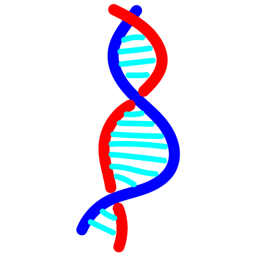
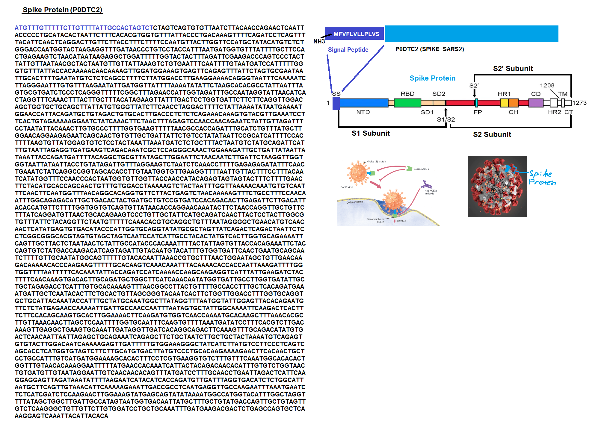
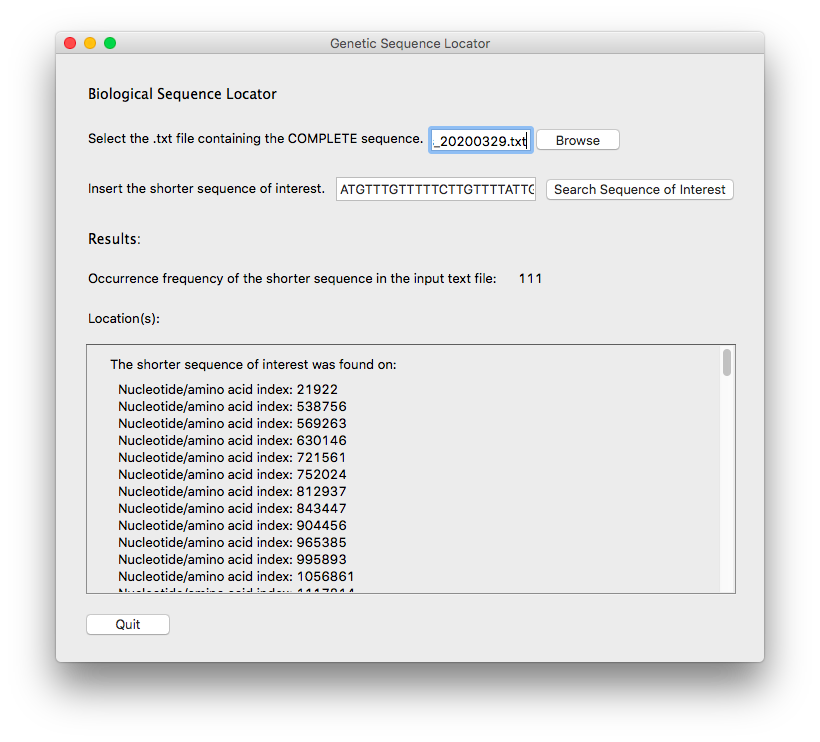

<!--
***Thank you for checking out my project. I am open to any suggestions for improvement.
***Please fork the repository and create a pull request or open an issue with the
***tag "improvement".
-->

# Biological Sequence Locator

<br />
<p align="center">
  <a href="https://github.com/reoyamanaka/biological_sequence_locator.git">
    
  </a>

  <h3 align="center">Biological Sequence Locator</h3>

  <p align="center">
    Locates genomic and peptide sequences for biological analysis.
    <br />
    <a href="https://github.com/reoyamanaka/biological_sequence_locator.git"><strong>Explore the docs »</strong></a>
    <br />
    <br />
    <a href="https://youtu.be/UYC1LXQQkf0">View Demo</a>
    .
    <a href="https://github.com/reoyamanaka/biological_sequence_locator/issues">Report Bug</a>
  </p>
</p>

<!-- Table of Contents -->

* [About the Project](#about-the-project)
  * [Built with](#built-with)
* [Getting Started](#getting-started)
  * [Prerequisites](#prerequisites)
  * [Installation](#installation)
* [Usage](#usage)
* [Contributing](#contributing)
* [License](#license)


## About The Project

<p align="left">
  <span>An important peptide sequence in COVID-19's Spike Protein (P0DTC2) is the <b>Signal Peptide</b>. The Signal Peptide enables the virus to bind to our cells for infection, so a researcher may be interested in locating all instances of its sequence in any given protein sequence. This program could help the researcher accomplish this.</span>
  <br />
  
</p>
<p>
<b>Source</b>: Wrapp, Daniel, Nianshuan Wang, Kizzmekia S. Corbett, Jory A. Goldsmith, Ching-Lin Hsieh, Olubukola Abiona, Barney S. Graha, and Jason S. McLellan. "Cryo-EM structure of the 2019-nCoV spike in the prefusion conformation". <i>Science</i> 367, Issue 6483 (13 March 2020): 1260-1263. DOI: 10.1126/science.abb2507   
</p>


<p align="center">
  
</p>

### Built With

* Python 3.8.1
* IDLE 3.8.1
* macOS High Sierra Version 10.13.6
* Adobe Illustrator Version 23.1 (Logo design)

## Getting Started

To get a local copy up and running follow these simple steps.

### Prerequisites

* Python 3.8.1

* wxPython
```sh
pip install wxpython
```


### Installation

1. Clone the repository
```sh
git clone https://github.com/reoyamanaka/biological_sequence_locator.git
```
2. Install wxPython module
```sh
pip install wxpython
```

## Usage

<div align="center">
  <strong>YouTube Demo</strong><br>
  <a href="https://youtu.be/UYC1LXQQkf0">
    
  </a>
</div>

## Contributing

I would greatly appreciate any contributions.

1. Fork the Project
2. Create your Feature Branch (`git checkout -b feature/CoolFeature`)
3. Commit your Changes (`git commit -m 'Added some CoolFeature'`)
4. Push to the Branch (`git push origin feature/CoolFeature`)
5. Open a Pull Request


## License

Distributed under the GNU Affero General Public License v3.0 License. See `LICENSE` for more information.


## Contact

Reo Yamanaka - [LinkedIn](https://www.linkedin.com/in/reo-yamanaka-7a2289119/) - [My YouTube channel](https://www.youtube.com/channel/UCBwqp_MEM2XcSnq7kRvOB3A) - ryamanaka807@gmail.com

Project Link: [https://github.com/reoyamanaka/biological_sequence_locator](https://github.com/reoyamanaka/biological_sequence_locator)
